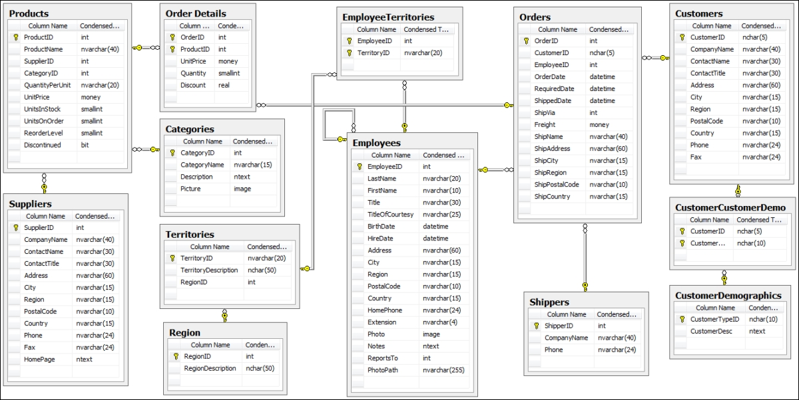
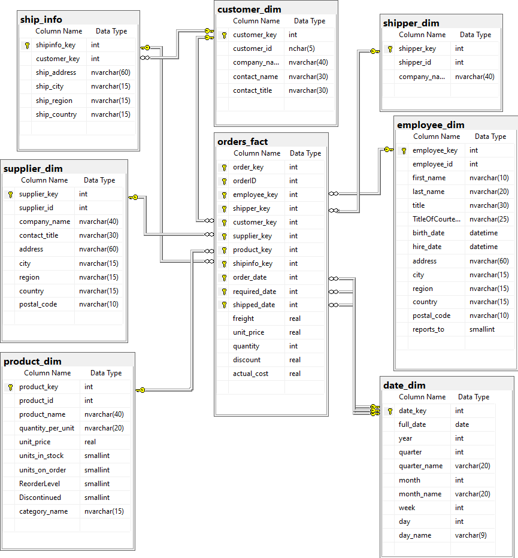
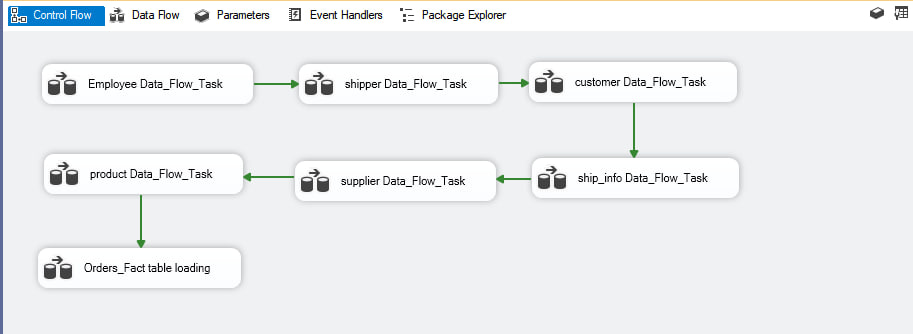
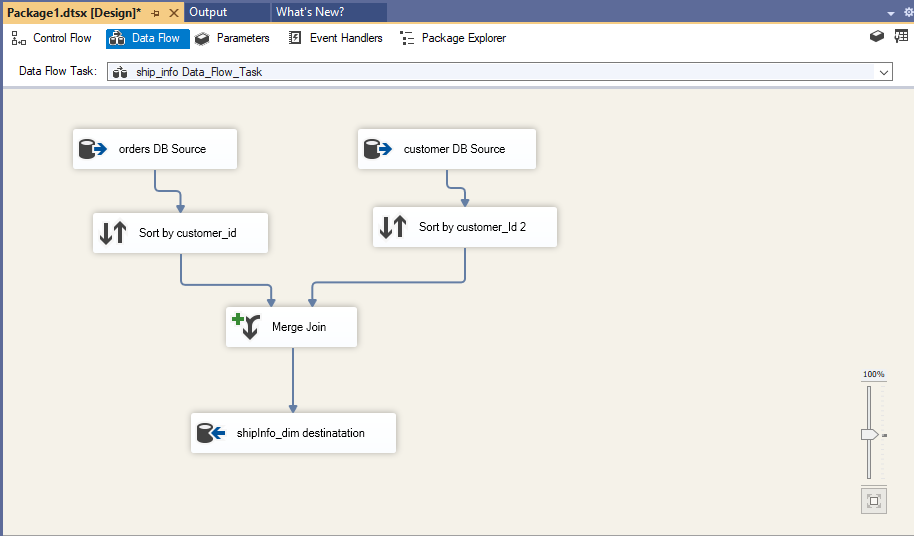

# northwind-data-warehouse
Designing a star schema data warehouse based on the Northwind database and implementing the ETL process using the SSIS tool.

## Overview:

The main purpose of this project is to implement the concept of a data warehouse using dimensional modeling, which involves identifying business processes, dimensions, facts, and granularity.
Develop a star schema design for the data warehouse.
Finally, the project involves loading data into the data warehouse using an SSIS ETL tool.

## Source and database

Northwind is a widely used educational database created by Microsoft, designed to represent a small, fictional company's data, such as its customers, orders, products, and suppliers. It includes tables for employees, customers, orders, order details, products, suppliers, and more. This database serves as a practical and realistic example for demonstrating various database concepts, including data modeling.

## Star Schema for the datawarehouse :

 A star schema has one fact table containing all the measurements we need about the any order have been placed , and containing all foreign keys from other dimentions. including the key of the bridged table 'ship_info'

## ETL process:

After designing the data warehouse, the implementation of it was carried out on SQL Server, as its code is shown in the file.
Using SSIS, I implemented the ETL process on this sequence :

There is an example for loading data in ' ship_info ' :

For Fact Table loading:

The first step involved collecting all the IDs from tables in the database using a Merge Join transformation in the same place. Next, I used a Lookup transformation to obtain the surrogate key for each dimension, applying any necessary transformations as needed. Here is the data flow task for the fact table :
 

for more about the transformation done in fact table , you can download the project and see it !
